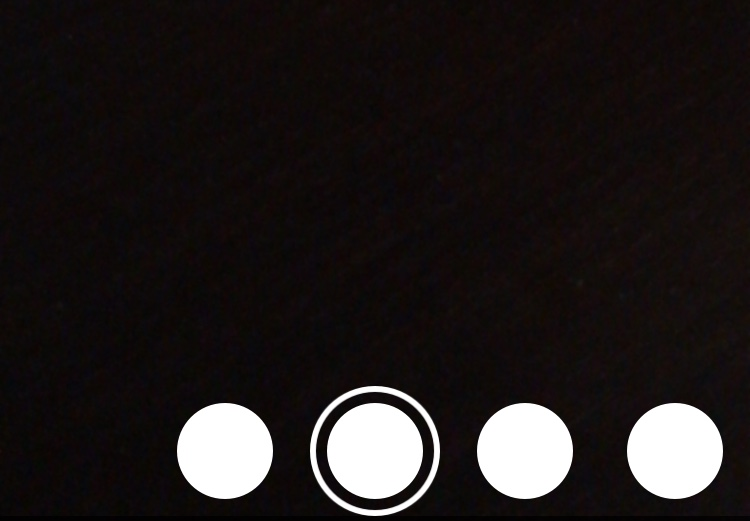

# UIMenuScroll

`MenuItemKit` creating menu how on Facebook Messenger on take photo



## Installation

[CocoaPods](https://cocoapods.org) is a dependency manager for Cocoa projects. You can install it with the following command:

```bash
$ gem install cocoapods
```

To integrate `UIMenuScroll` into your Xcode project using CocoaPods, specify it in your `Podfile`:

```ruby
source 'https://github.com/CocoaPods/Specs.git'
platform :ios, '10.0'
use_frameworks!

target '<Your Target Name>' do
pod 'UIMenuScroll', '~> 0.0.1'
end
```

Then, run the following command:

```bash
$ pod install
```

## How to use

Add UIView to storyboard and set class `UIMenuScrollView` to view.  
Add delegate to `UIMenuScrollView` in your ViewController.

``` swift
@IBOutlet weak var menuScroll: UIMenuScrollView!

// ...

override func viewDidLoad() {
    super.viewDidLoad()
    // ...
    
    // MenuScroll configuration
    menuScroll.delegate = self
    menuScroll.spacing = 10.0
    
    // ...
}
```

Then create extension for your ViewController.

``` swift
extension ViewController: UIMenuScrollViewDelegate {

    /// Set count a elements in menu scroll
    func menuScroll(menuScroll: UIMenuScrollView) -> Int
    { ... }

    /// Set options to single button on menu scroll
    func menuScroll(menuScroll: UIMenuScrollView, createdButton: UIButton, index: Int) 
    { ... }

    /// Touch button event
    func menuScroll(menuScroll: UIMenuScrollView, touchSender: UIButton, index: Int) 
    { ... }

    /// Set options to center indicator image
    func menuScroll(menuScroll: UIMenuScrollView) -> UIImage
    { ... }

}
```

## About Me

* Aleksey Pleshkov
* Email: [im@alekseypleshkov.ru](mailto:im@alekseypleshkov.ru)
* Website: [alekseypleshkov.ru](https://alekseypleshkov.ru)

## License

`MenuItemKit` is released under the MIT license. In short, it's royalty-free but you must keep the copyright notice in your code or software distribution.
